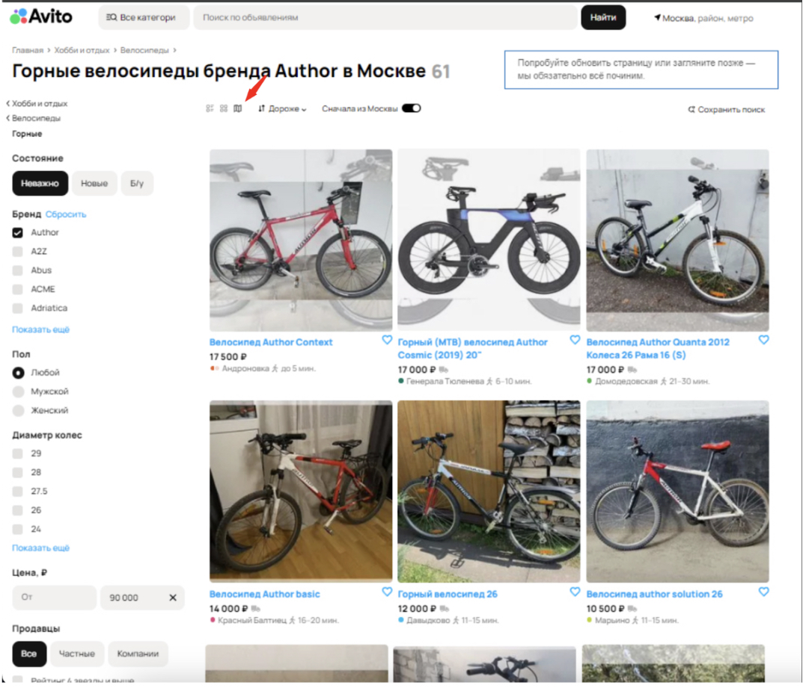
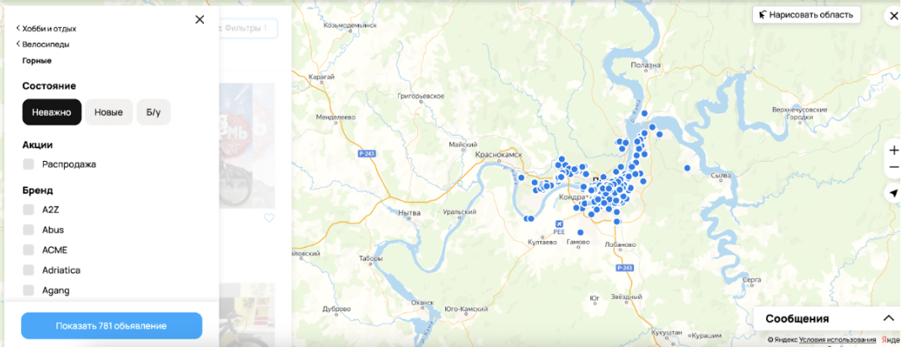
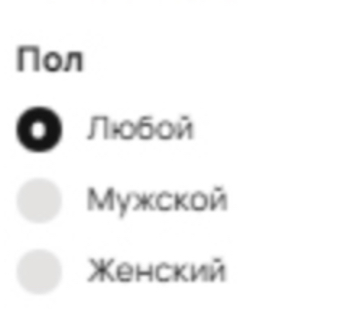
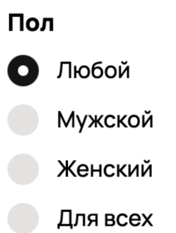
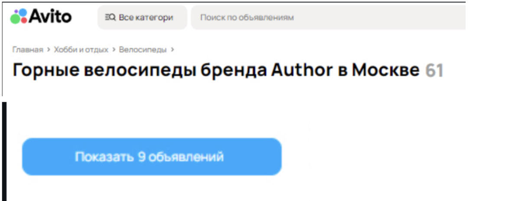
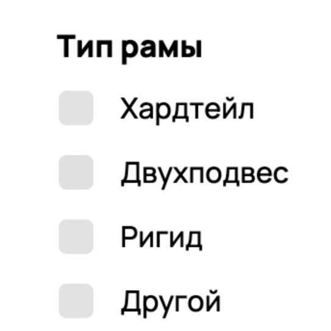

# Баг-репорты Avito

## 1. Отображаемый вид объявлений не соответствует выбранному
**Шаги:**
1. Открыть [Avito](https://www.avito.ru/)
2. Выбрать регион поиска **Москва**
3. Выбрать **Все категории → Хобби и отдых → Велосипеды → Горные**
4. Выбрать список отображения **на карте**

**ФР:**

**ОР:**

**Приоритет:** Высокий. Данная ошибка приводит к тому что предоставленный пользователю функционал не работает, и нет возможности просматривать объявления на карте, что может привести к усложнения поиска путем установления необходимых фильтров.

---

## 2. Товары на странице не отсортированы по выбранному признаку
**Шаги:**
1. Открыть [Avito](https://www.avito.ru/)
2. Выбрать регион поиска **Москва**
3. Выбрать **Все категории → Хобби и отдых → Велосипеды → Горные**
4. Выбрать сортировку **Дороже**
 
**ФР:** Товары отсортированы по умолчанию  
**ОР:** Товары отсортированы от большей к меньшей стоимости

**Приоритет:** Средний. Данная ошибка увеличивает время поиска необходимых товаров, и усложняет сам процесс поиска.

---

## 3. В фильтрации выбора “Пол” отсутствует радиобатон “Для всех”
**Шаги:**
1. Открыть [Avito](https://www.avito.ru/)
2. Выбрать регион поиска **Москва**
3. Выбрать **Все категории → Хобби и отдых → Велосипеды → Горные**

**ФР:**

**ОР:**

**Приоритет:** Средний. Данная ошибка приводит к тому что пользователь вынужден выполнить запрос дважды и потратить больше времени на поиск необходимых товаров.

---

## 4. Расходится количество, указанное в заголовке объявления, на кнопке “Показать № объявлений” и в нумерованной пагинации
**Шаги:**
1. Открыть [Avito](https://www.avito.ru/)
2. Выбрать регион поиска **Москва**
3. Выбрать **Все категории → Хобби и отдых → Велосипеды → Горные**
4. Отметить чекбокс **“Author”** в фильтре **Бренд**
5. Нажать на кнопку **“Показать № объявлений”**

**ФР:** Количество не соответствует сумме объявлений

**ОР:** Количество единое и соответствует сумме объявлений  

**Приоритет:** Низкий. Данная ошибка не влияет на процесс поиска, но может привести к путанице при подсчете количества объявлений.

---

## 5. Отсутствует фильтр “Тип рамы”
**Шаги:**
1. Открыть [Avito](https://www.avito.ru/)
2. Выбрать регион поиска **Москва**
3. Выбрать **Все категории → Хобби и отдых → Велосипеды → Горные**

**ФР:** 
Фильтр отсутствует
**ОР:** 
Фильтр присутствует

**Приоритет:** Средний. Данная ошибка приводит к замедлению процесса поиска, и усложняет сам процесс поиска.